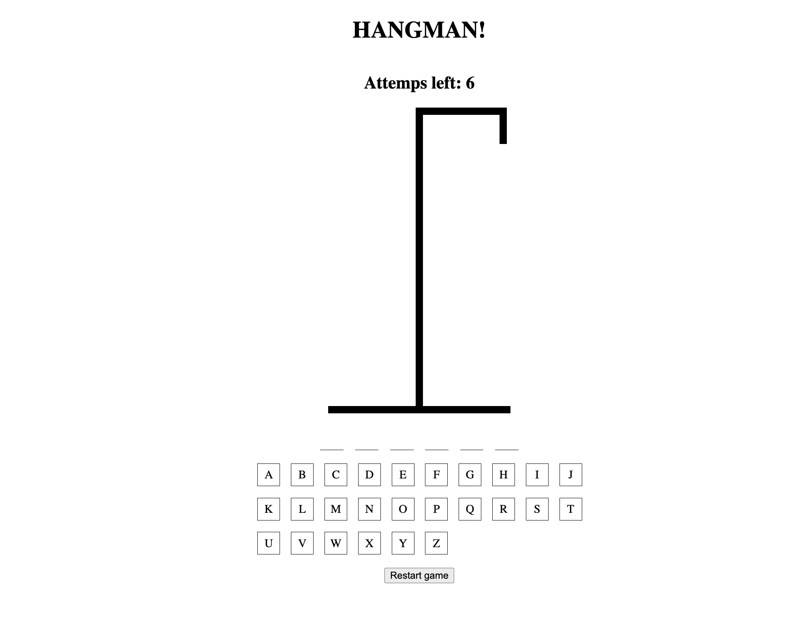

# React Hangman

Small hangman game built with React as a POC of styled-components.

## Getting Started

### Development

You can run the project locally by running the following commands:

```sh
cd react-hangman
yarn
yarn dev
```

### Docker

Run it with docker-compose by running the following commands:

```sh
cd react-hangman
docker-compose up -d
```

This will start the app on [htpp://localhost:3000](htpp://localhost:3000)

## Quick Overview

<div style="display:flex; gap:1.5em">

<div style="flex:1">


</div>
<div style="flex:1">


</div>

</div>

<div style="margin:0 1em">



</div>
